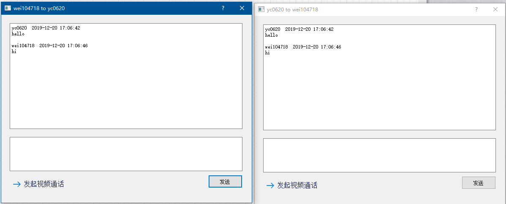
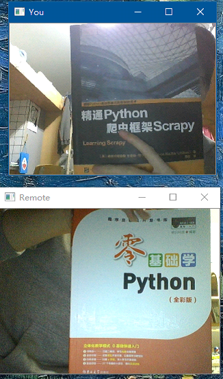
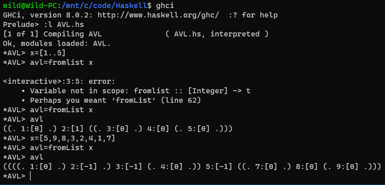
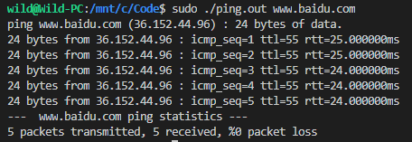
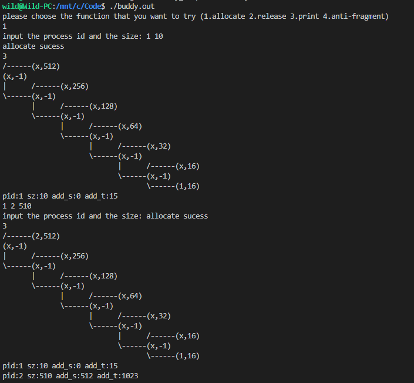
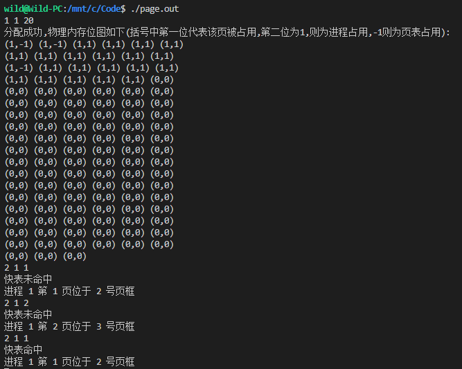
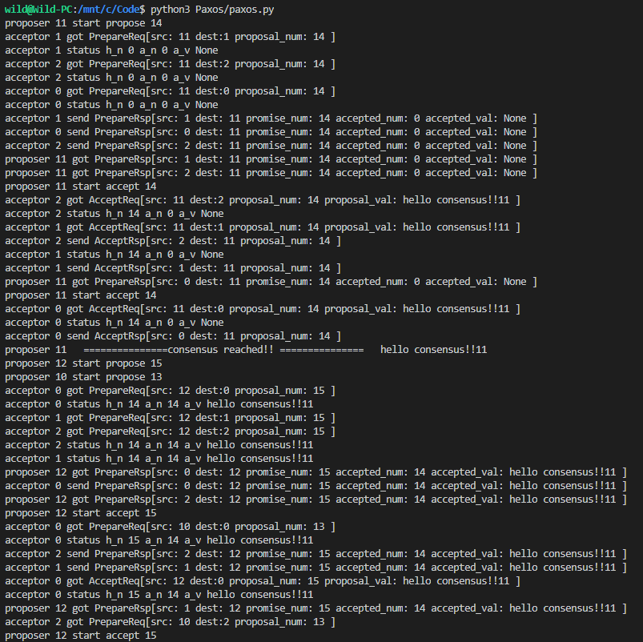
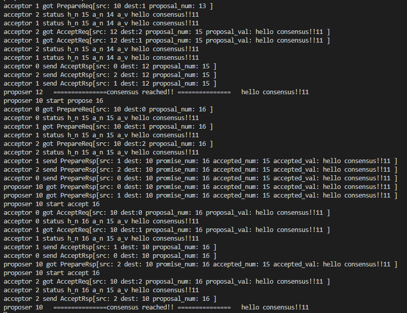

# 一些小东西
## chatRoom
命令行下的聊天室，server负责转发与管理用户，python，多线程。
## Ychat
粗糙的图形界面，增加了用户数据库，可进行文本，语音，视频通话

## Haskell
Haskell 编写了AVL树，红黑树写了插入部分，删除部分待完成

## HUST2020
尝试用较标准的方式去写C/C++，使用了google测试模块
## Network
编写了TCP，UDP的通信程序；ICMP的ping命令，linux下

## OS
编写了伙伴堆内存分配算法；页式管理算法，支持多级页表，TLB替换算法采用FIFO

## Paxos
多线程模拟Paxos算法，通信采用消息队列

## R
海草数量分析案例，电子游戏效率分析案例
